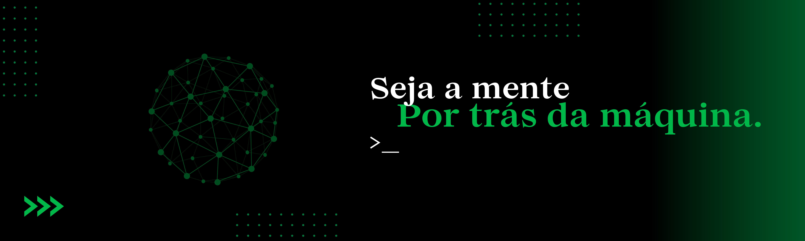

  

---

---

### 🚀 Sobre mim

<h3 align="left">
  
  Pronouns: he | him
</h3>

<h3 align="left">
  
  Desenvolvedor de sistemas especializado em TOTVS Protheus (AdvPL / TLPP)
</h3>

<h3 align="left">
  
  Focado em evoluir como dev Python e Front-end
</h3>

<h3 align="left">
  
  Apaixonado por projetos próprios e desafios criativos
</h3>

<h3 align="left">
  
  Baseado em São Paulo - Brasil
</h3>

<h3 align="left">
  
  Aprendendo algo novo todos os dias 👾
</h3>

---

### 🧠 Tecnologias que trabalho e estudo

  
  
  
  
  
  
  

---

### 📊 GitHub Stats

  

---

### 🌱 Projetos em destaque

- 🔸 [Calculadora Web](https://github.com/gabreeugm/CalculadoraWeb)
- 🔸 [Gerador de Senha](https://github.com/gabreeugm/GeradorDeSenha)
- 🔸 [Landing Page](https://github.com/gabreeugm/LandingPage)

---

### 📫 Vamos nos conectar?

  
  

---

✨ Obrigado por visitar meu perfil! Se curtir algum projeto, deixa uma ⭐ ou me chama pra trocar uma ideia!

